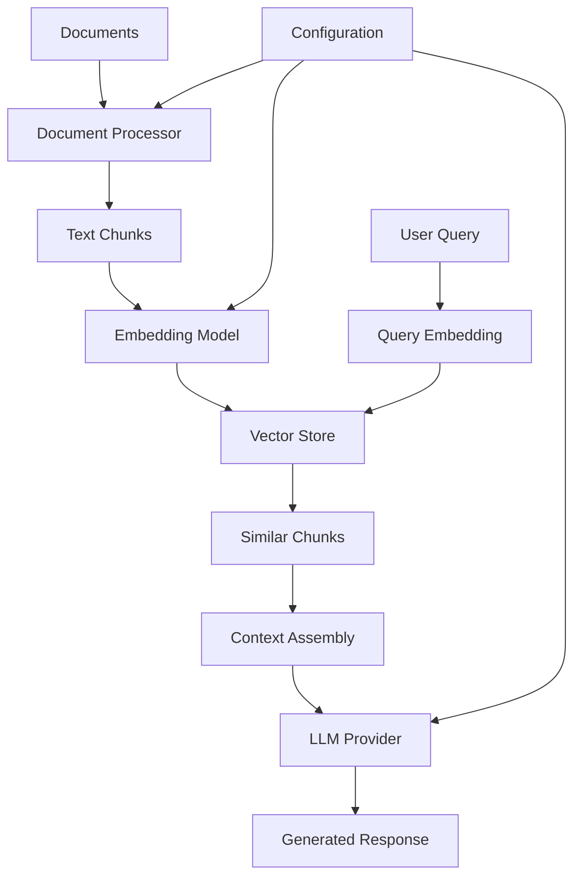

# System Architecture

## Overview

The SGLang RAG System follows a modular architecture designed for scalability, maintainability, and performance.

## Core Components

### 1. Document Processing Pipeline

```
Raw Documents → Text Chunking → Embeddings → Vector Index
```

**Document Processor** (`src/rag_system/document_processor.py`):
- Handles multiple document formats (.txt, .md, .pdf)
- Implements intelligent text chunking with overlap
- Maintains document metadata and source tracking

**Key Features**:
- Configurable chunk size (default: 500 tokens)
- Overlap strategy to preserve context (default: 50 tokens)
- Unicode-aware text processing

### 2. Vector Store

```
Query → Embedding → Similarity Search → Relevant Chunks
```

**Vector Store** (`src/rag_system/vector_store.py`):
- FAISS-based vector database for fast similarity search
- Supports multiple distance metrics (cosine, euclidean, dot product)
- Persistent storage with automatic index serialization

**Performance Characteristics**:
- Index build time: O(n log n) where n = number of chunks
- Query time: O(log n) with FAISS IVF index
- Memory usage: ~1.5GB per 1M documents (384-dim embeddings)

### 3. LLM Integration

```
Context + Query → Prompt Template → LLM API → Response
```

**LLM Providers** (`src/rag_system/llm_providers.py`):
- Multi-provider support (Groq, OpenAI, Anthropic)
- Automatic failover and retry logic
- Response caching and rate limiting

**Supported Models**:
- Groq: Mixtral-8x7B, Llama-2-70B
- OpenAI: GPT-4, GPT-3.5-turbo
- Local: Ollama integration

### 4. RAG Pipeline

```
User Query → Retrieval → Context Assembly → Generation → Response
```

**RAG System** (`src/rag_system/rag_pipeline.py`):
- Orchestrates the entire retrieval-augmented generation process
- Implements context ranking and filtering
- Handles prompt engineering and response post-processing

## Data Flow



## Configuration

The system uses a centralized configuration approach:

```python
# config/settings.env
EMBEDDING_MODEL=all-MiniLM-L6-v2
CHUNK_SIZE=500
CHUNK_OVERLAP=50
TOP_K_RESULTS=3
DEFAULT_PROVIDER=groq
```

## Scalability Considerations

### Horizontal Scaling
- **Vector Store**: Can be sharded across multiple FAISS indices
- **LLM Providers**: Load balancing across multiple API keys
- **Document Processing**: Parallelizable across CPU cores

### Vertical Scaling
- **Memory**: Scales with corpus size (~1.5GB per 1M docs)
- **CPU**: Benefits from multi-core for document processing
- **Storage**: Index size is ~30% of raw document size

## Security

- **API Keys**: Stored in environment variables, never committed
- **Input Validation**: All user inputs sanitized and validated
- **Rate Limiting**: Built-in protection against API abuse
- **Audit Logging**: All queries and responses logged for monitoring

## Extension Points

The architecture supports easy extension:

1. **New Document Types**: Add processors in `document_processor.py`
2. **New Vector Stores**: Implement `VectorStore` interface
3. **New LLM Providers**: Implement `LLMProvider` interface
4. **Custom Embedding Models**: Configure in settings

## Performance Monitoring

Built-in metrics collection:

- Query latency (p50, p95, p99)
- Vector search time vs LLM generation time
- Cache hit rates and API call counts
- Memory usage and index size

See [Performance Guide](../guides/performance.md) for optimization strategies.
